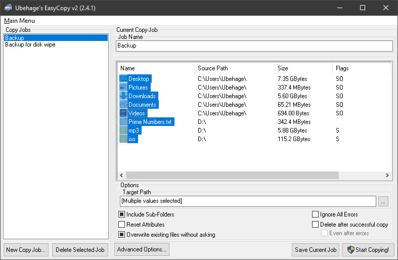

# EasyCopy v2

EasyCopy v2 is a legacy file copying utility designed for speed, flexibility, and robust handling of large datasets and file hierarchies.

## Features

- **Job Management:**  
  Define and save copy jobs for repeated use. Manage multiple copy jobs for different tasks (e.g., backup, disk-wipe preparation).
- **Bulk File Copying:**  
  Create copy jobs covering many files/folders across drives. Handles large file counts efficiently.
- **Optimized Scanning:**  
  Rapid file system traversal is a design priority.
- **Visual Feedback:**  
  Employs TreeView and ListView controls (Windows Common Controls v6) for job and file visualization.
- **Advanced Copy Options:**  
  - Include/exclude subfolders
  - Attribute reset
  - Error ignoring
  - Overwrite rules
  - Post-copy deletion

## Architecture

EasyCopy v2 is structured in three parts:
- **Main Application**: The user interface, job manager, and queue handler.
- **File Copier**: A dedicated executable for performing the actual file operations.
- **Shared DLL**: Contains common routines and code shared between the main program and the file copier.

## Dependencies & Requirements

- **VB6 Runtime** (Required)
- **Windows Common Controls v6** for TreeView and ListView
- **Windows OS:** XP/2000 or newer, with the above components available

## Limitations

- **Old-school Visuals:**  
  Classic VB6 UI. Straightforward, but not modern.
- **File Icon Extraction:**  
  Self-taught, basic, and not optimized; performance may lag in icon-heavy folders.
- **No Modern Themes.**
- **Multiple Exe/DLL Approach:**  
  Requires all binaries present; source may need manual tweaking to rebuild.

## Usage

1. Launch the main application.
2. Select or create a **Copy Job**.
3. Choose files/folders and target destination; configure options.
4. Start copying!  
   Save jobs for future use.

## Building

- **Language:** Visual Basic 6 (VB6)
- **Project structure:** EXE (main), EXE (file copier), DLL (shared library)
- **Dependencies:**  
  Make sure `MSCOMCTL.OCX` and VB6 runtime files are installed on the system.

## Why Publish?

This project is released for preservation, learning, and for those needing a fast, no-nonsense file copier/backup job manager on classic Windows.  
The code is imperfect, but does its job; architecture decisions reflect the time and learning process of its creation.

## Author

- Developed by: [Ubehage]

## License

Released under MIT License.

## Contributions

Improvements welcomed! If you modernize the visuals, fix icon code, or refactor the architecture, please consider sharing.

---
